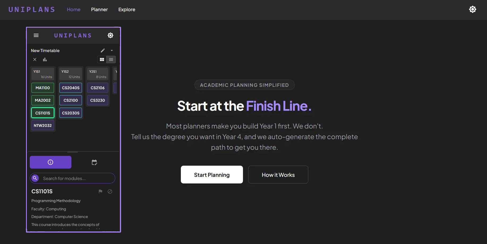
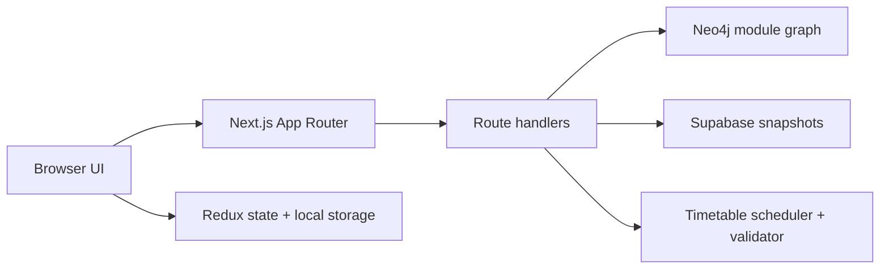

# UniPlans



UniPlans is an interactive academic planner for NUS modules. Start with the modules you want to complete, and UniPlans works backwards through their prerequisites to propose a semester-by-semester path. You can then adjust the result, track progress, compare multiple timetables, and share a plan.

> UniPlans is a planning aid, not an official degree-audit or academic-advice system. Module information and generated plans may be incomplete or out of date. Always verify prerequisites, preclusions, availability, workload, and graduation requirements with official NUS sources.

## Features

### What you can do

- Search the NUS module catalogue by code or title.
- Mark modules as **targets** that you want the planner to work towards.
- Mark completed or waived modules as **exempted** so they can satisfy prerequisites without being scheduled.
- Generate a plan with configurable workload and optional special terms.
- Preserve the first part of an existing timetable when regenerating the rest.
- Drag modules between semesters and see prerequisite, availability, preclusion, and exam-clash issues.
- Create, rename, duplicate, and switch between multiple timetables.
- Record grades and tags, view workload and GPA summaries, and switch between detailed and compact views.
- Share a timetable using a snapshot link or import a shared snapshot.
- Explore the prerequisite graph for the active timetable.
- Use the planner on desktop or mobile, in light or dark mode.

### Plan a timetable

1. Open **Planner** and use the search panel to find a module.
2. Select the flag icon to make it a target. Use the blocked icon for a module you have already completed or do not need to schedule.
3. Open the **Generate** tab, choose the maximum units per semester, and decide whether to include special terms.
4. If you already have a partial plan, enable **Preserve Current Timetable** and choose how many early semesters to keep.
5. Select **Generate Timetable**.
6. Review any warnings, then drag modules to refine the proposed plan.

Targets and exemptions are mutually exclusive: the most recent choice wins. The planner currently accepts up to 20 target modules and 50 exempted modules, with an even workload limit from 16 to 40 units per semester.

### Saving and sharing

Plans are saved in the current browser using local storage. Clearing site data or moving to another browser will remove local plans.

The timetable menu lets you create or duplicate plans. **Share** creates a snapshot in Supabase and copies an import link to the clipboard. Shared snapshots contain the semester layout and module tags; grades and student context are not included. Admission cohort and programme category are saved privately with each local timetable, copied when duplicating it, and left unset when importing a shared snapshot. Set them in the Generate panel to evaluate conditional prerequisites.

## Tech Stack

- Next.js 16 and React 19
- TypeScript
- Material UI and Emotion
- Redux Toolkit, RTK Query, and Redux Persist
- Neo4j for modules and prerequisite relationships
- Supabase for shared timetable snapshots
- Cytoscape.js for graph visualization
- Jest and ts-jest for tests

### Architecture



The planner keeps its working state in Redux and persists it locally. Route handlers load module and graph data from Neo4j, run the scheduler on the server, and store or retrieve shareable snapshots from Supabase.

### Prerequisites

- Node.js 20.9 or newer
- npm
- A Neo4j database
- A Supabase project

### Local setup

1. Clone the repository and install dependencies:

   ```bash
   git clone https://github.com/songqiaoyuchen/uniplans.git
   cd uniplans
   npm install
   ```

2. Create `.env.local` in the project root:

   ```dotenv
   DB_URI=neo4j+s://your-neo4j-host
   DB_USER=neo4j
   DB_PASSWORD=your-neo4j-password

   SUPABASE_URL=https://your-project.supabase.co
   SUPABASE_PUBLISHABLE_DEFAULT_KEY=your-supabase-publishable-key

   # Required for the protected /api/keepAlive cron endpoint.
   CRON_SECRET=use-a-long-random-value
   ```

   These are server-side variable names; do not replace them with the older `NEXT_PUBLIC_*` names.

3. Create the snapshot table in Supabase:

   ```sql
   create table if not exists timetable_snapshots (
     id text primary key,
     data jsonb not null,
     created_at timestamptz not null default now()
   );
   ```

   The key and Row Level Security policy used by the app must permit the server to insert and read this table. Choose policies appropriate for your deployment before exposing it publicly.

4. Validate the bundled catalogue before populating Neo4j:

   ```bash
   npm run resetDB -- --dry-run --source local
   ```

   This is also the default behavior of `npm run resetDB`: it does not connect to Neo4j or overwrite catalogue files. Unavailable prerequisites are reported and retained as blocked paths, not silently discarded.

   For a new, empty database, initialize one publication lock anchor under exclusive maintenance:

   ```cypher
   MERGE (metadata:ImportMetadata {name: 'prerequisites'})
   ON CREATE SET metadata.status = 'uninitialized';
   ```

   After reviewing the preflight report, verifying the destination, and backing up any existing graph, explicitly publish:

   ```bash
   npm run resetDB -- --apply --source local
   ```

   **Warning:** `--apply` replaces the application's Module/Logic graph in one transaction. Failures before commit roll back; a lost commit acknowledgement requires checking the publication metadata. Do not run this against an unapproved database. Generation refuses old graph schemas or catalogue fingerprints that do not match the deployed app.

   `npm run resetDB -- --help` describes prepared-snapshot and download options. Downloads require an explicit staging file outside `src/data`; they do not update the deployed app's static catalogue. Deploy matching catalogue data separately, and do not repeatedly run the scraper.

5. Start the development server:

   ```bash
   npm run dev
   ```

6. Open [http://localhost:3000](http://localhost:3000).

### Verification

Run the test suite, TypeScript check, and production build before opening a pull request:

```bash
npm exec -- jest --runInBand
npm exec -- tsc --noEmit
npm run build
```

### Package scripts

| Command | Purpose |
| --- | --- |
| `npm run dev` | Start the development server with Turbopack. |
| `npm run build` | Create and validate a production build. |
| `npm start` | Serve a completed production build. |
| `npm run lint` | Run ESLint over the application source. |
| `npm run resetDB` | Validate the local catalogue without connecting to Neo4j; publication requires explicit `--apply`. |

### Timetable API guardrails

`POST /api/timetable` validates and normalizes input before loading a graph or running the scheduler.

| Input | Accepted value |
| --- | --- |
| `required` | 1–20 known, unique module codes |
| `exempted` | 0–50 known, unique module codes |
| `specialTerms` | Boolean |
| `maxMcs` | Even integer from 16 to 40 |
| `preservedTimetable` | Semester IDs 0–20, with at most 50 modules per semester |
| `studentContext` | Optional object with nullable four-digit integer `cohortYear` and supported `programmeType`; unset facts block only dependent prerequisite paths |

A module cannot be both targeted and exempted. Successful responses include the proposed timetable plus scheduler validation errors, warnings, and statistics; callers should check `isValid` before treating a proposal as valid.

### Project layout

```text
src/
├── app/                 Pages, planner UI, and route handlers
├── components/          Shared layout and UI components
├── constants/           Shared product and scheduler limits
├── data/                Generated/static module datasets
├── db/                  Neo4j connection and queries
├── scripts/             Neo4j reset and NUSMods data scripts
├── services/            Client and server service integrations
├── store/               Redux slices, middleware, and selectors
├── types/               Shared TypeScript types
└── utils/
    ├── graph/            Graph normalization, scheduling, and validation
    └── planner/          Planner validation and display helpers
```

The development-only graph inspection pages are `/formatted-graph`, `/normalised-graph`, and `/final-graph`. The user-facing dependency view is `/explore`.

### Deployment notes

- Add every environment variable listed above to the deployment environment.
- `vercel.json` schedules `/api/keepAlive` once per day. The proxy rejects the request unless its `Authorization` header is `Bearer <CRON_SECRET>`.
- Keep Neo4j credentials server-side and configure production Supabase access policies deliberately.
- Run `npm run build` with production environment variables before deployment.

## Data and responsible use

The repository includes module data derived from NUSMods and scripts that can refresh it. Respect upstream rate limits and terms of use. A successful scheduler validation means the proposal passed the rules encoded in this application; it does not guarantee that the plan satisfies every current university or programme requirement.
